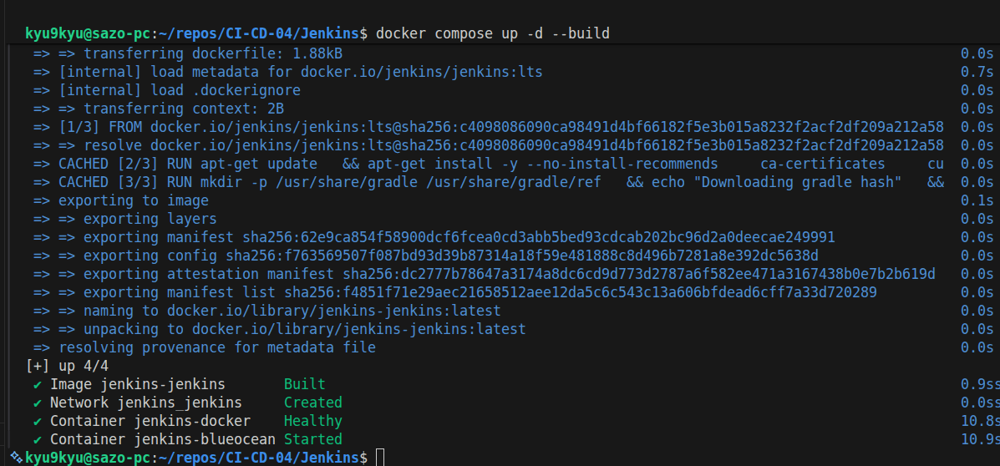
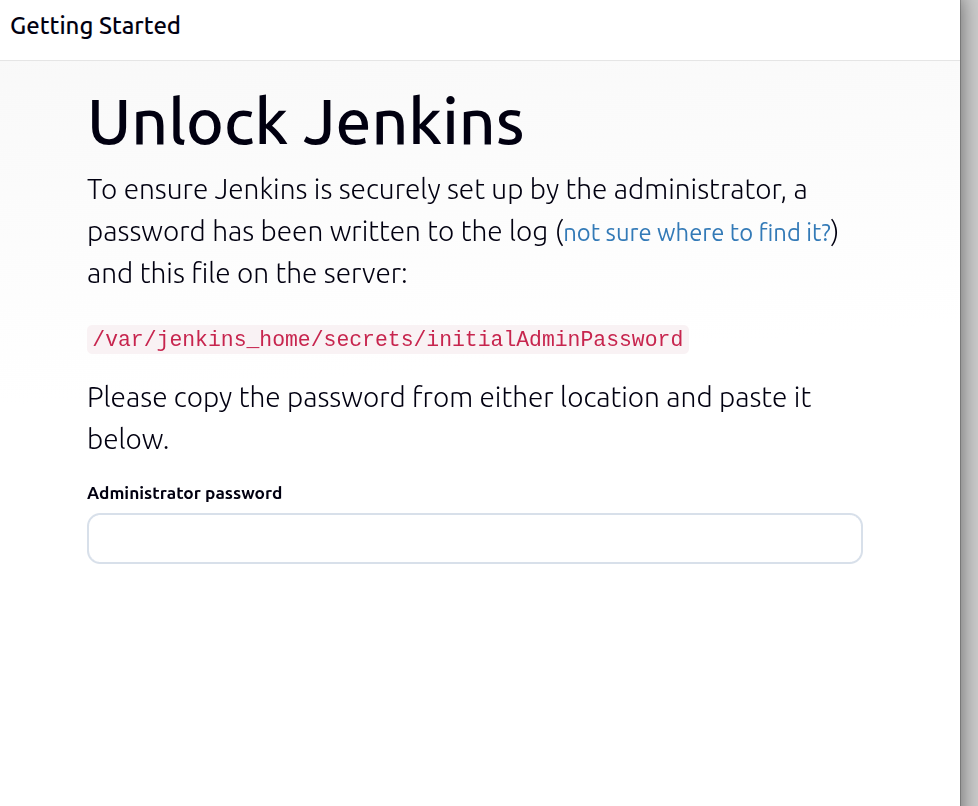
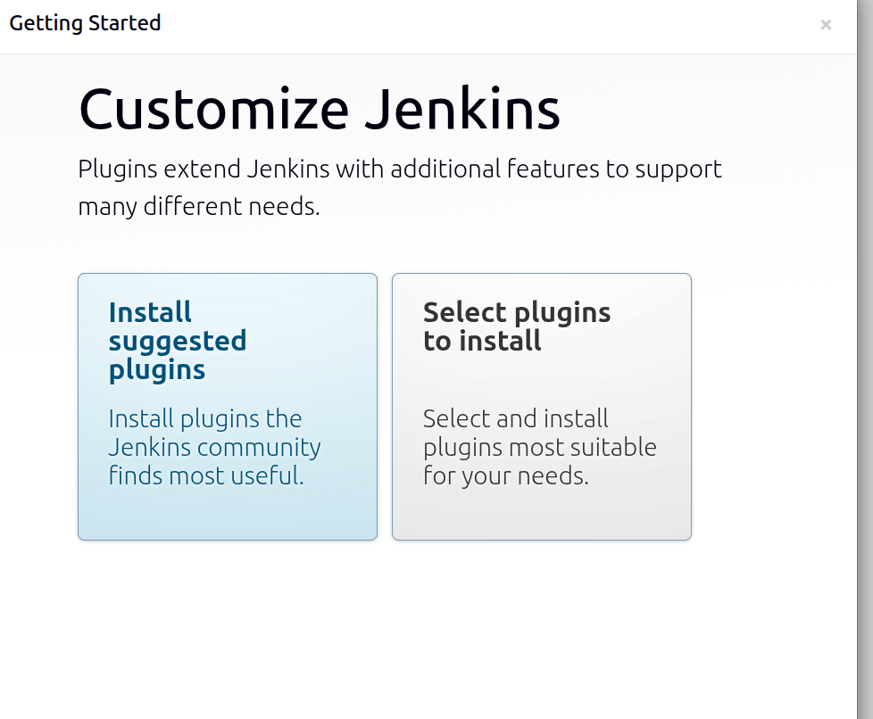
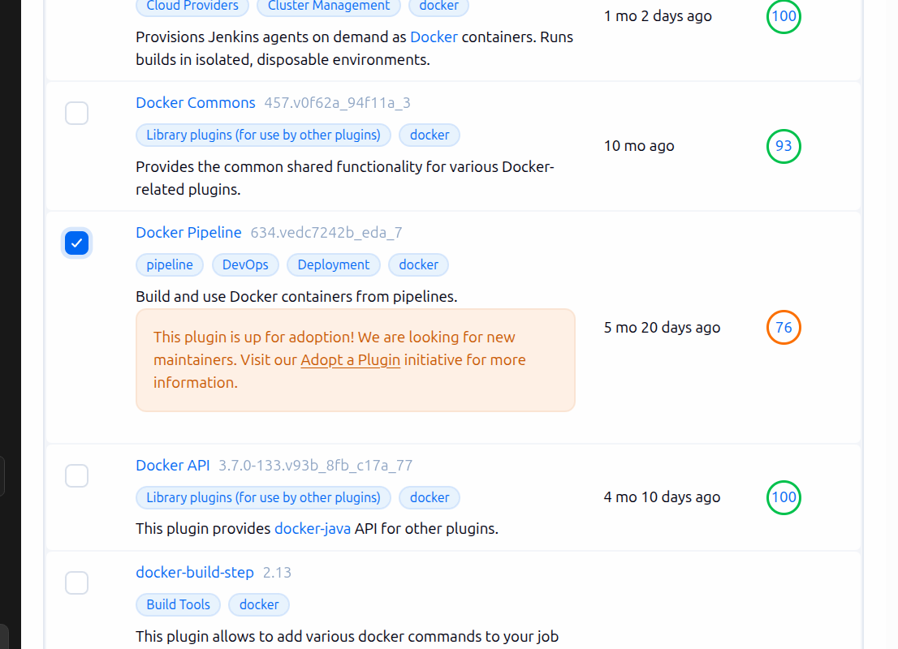
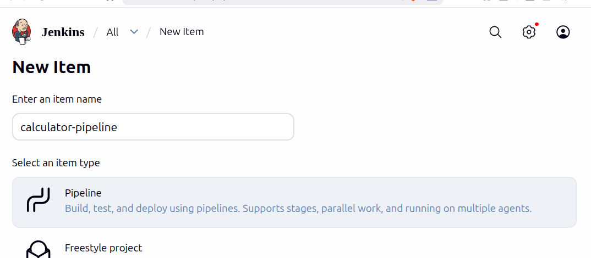
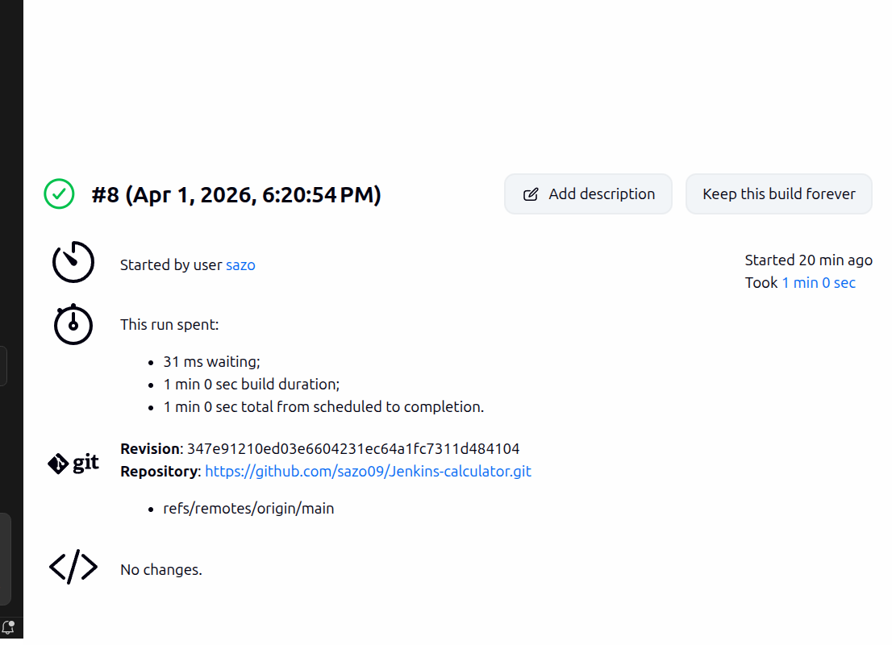
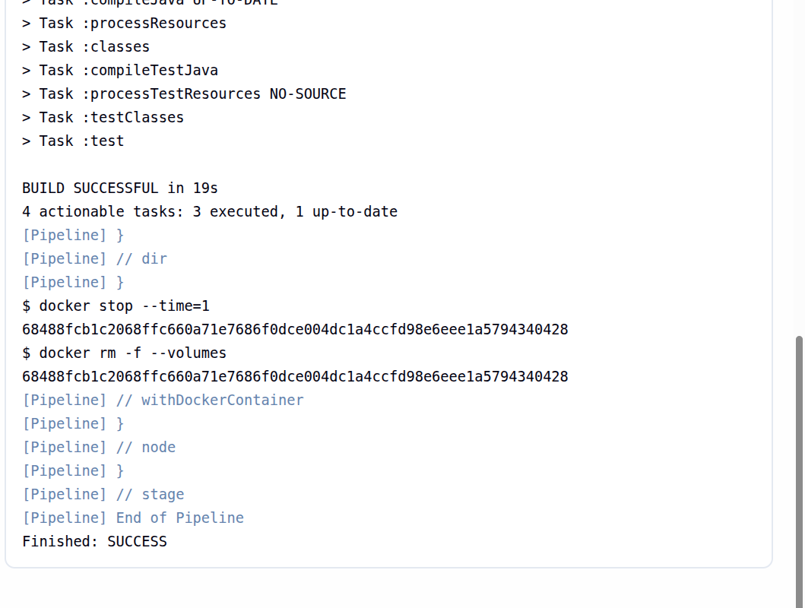

# CI/CD 04 - Jenkins (Java + Gradle)

Este repositorio documenta la ejecucion del ejercicio de Jenkins para una aplicacion Java + Gradle con pipeline declarativa y ejecucion con Docker.

## Objetivo del ejercicio

- Definir una pipeline declarativa con stages de `Checkout`, `Compile` y `Unit Tests`.
- Usar `gradle:6.6.1-jre14-openj9` como build runner.
- Ejecutar Jenkins en local con Docker y Docker-in-Docker.

## Estructura usada

- Repositorio de pipeline e infraestructura: `https://github.com/sazo09/CI-CD-04.git`
- Repositorio de codigo fuente Java: `https://github.com/sazo09/Jenkins-calculator.git`
- Jenkinsfile en este repo: `Jenkins/Jenkinsfile`

## 1. Levantar Jenkins con Docker Compose

Desde la carpeta `Jenkins/`:

```bash
docker compose up -d --build
```

Comprobar estado:

```bash
docker compose ps -a
```

Pantalla inicial de Jenkins:



## 2. Obtener password inicial de administrador

Comando recomendado:

```bash
docker logs jenkins-blueocean | grep -A 5 -i password
```

Con ese valor se desbloquea Jenkins en la pantalla "Unlock Jenkins".



## 3. Instalacion inicial y usuario

- Seleccionar `Install suggested plugins`.
- Crear el usuario administrador.



## 4. Instalar plugin necesario para Docker en pipeline

En `Manage Jenkins > Plugins`, instalar:

- `Docker Pipeline`



## 5. Crear job de tipo Pipeline

- Click en `New Item`
- Nombre del job
- Tipo: `Pipeline`



## 6. Configurar Pipeline desde SCM

En la seccion `Pipeline` del job:

- `Definition`: `Pipeline script from SCM`
- `SCM`: `Git`
- `Repository URL`: `https://github.com/sazo09/CI-CD-04.git`
- `Branch Specifier`: `*/main`
- `Script Path`: `Jenkins/Jenkinsfile`

Nota: el stage `Checkout` del Jenkinsfile descarga el codigo Java desde `https://github.com/sazo09/Jenkins-calculator.git`.

## 7. Ejecutar y validar resultado

- Click en `Build Now`
- Verificar ejecucion de los stages:
	- `Checkout`
	- `Compile`
	- `Unit Tests`

Resultado final:


